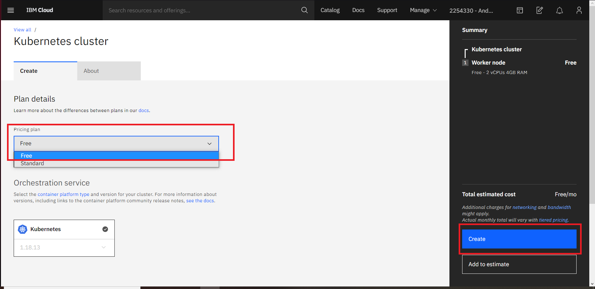
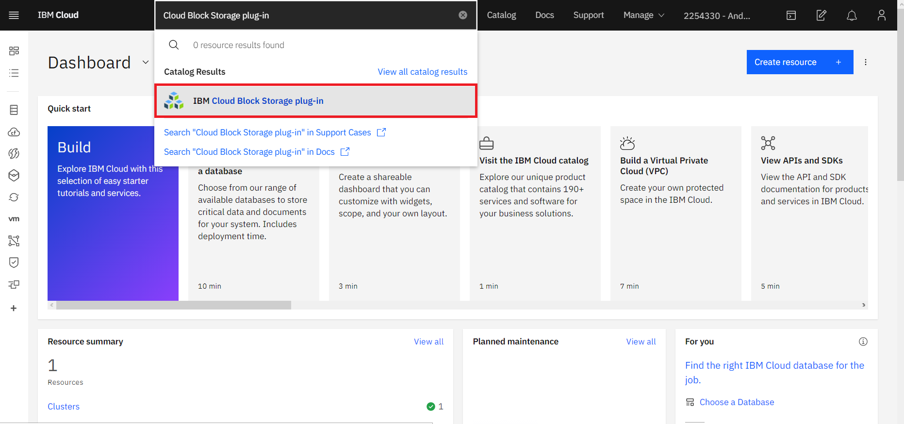
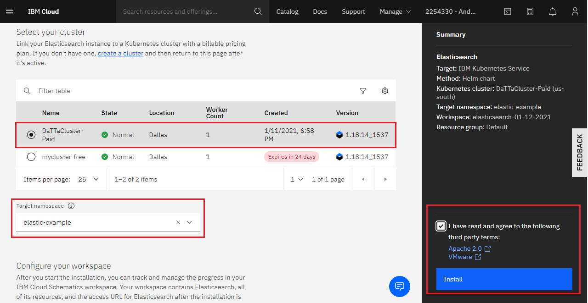
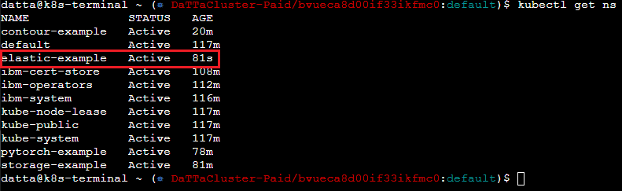
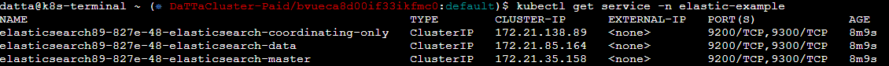

# Install Elasticsearch on IBM Cloud

## Pre-requisites
You must have an account created in IBM Cloud. The account needs to be either be *Pay-As-You-Go* or *Subscription*. Click [here](https://cloud.ibm.com/docs/account?topic=account-accounts "here") to read more.
If you have a Lite account, you can upgrade it. Click [here](https://cloud.ibm.com/docs/account?topic=account-account-getting-started#account-gs-upgrade "here") to learn how to upgrade.

## Step 1: Provision Kubernetes Cluster

* Click on the search section at the top of the main page, type Kubernetes and then choose Kurbenetes cluster.

* A new window opens, select between the free and standard type under "Pricing plan". We'll choose the free plan for the purposes of this documentation. Once selected, click on create.

* We then wait a few minutes. The following checkmark and the word 'normal' will appear once the Kubernetes Cluster is deployed.

## Step 2:  Deploy the IBM Cloud Block Storage plug-in

* Click on the search section at the top of the main page, select IBM Cloud Block Storage and click on it.

* A new window opens, select the cluster and enter the name you want for this workspace, in this case, it will be called _storage-example_, accept the terms, click *Install* and wait a few minutes.

## Step 3: Install Elastic Search

* Click on the search section at the top of the main page, type Elasticsearch and click on it.

* A new window opens, select the cluster and enter the name you want for the Elasticsearch workspace, in this case, it will be called _elastic-example_, accept the terms and click on *Install*. You can modify the different installation parameters at the bottom. We will leave them by default as shown below, but you can read more about setting up the parameters [here](https://cloud.ibm.com/catalog/content/contour-Qml0bmFtaS1jb250b3Vy-global#about "here").

## Step 4: Verify Installation

* Go to the *Resources List* in the Left Navigation Menu and click on *Kubernetes*

* Click the *Actions* button and select *Web terminal*.

* A window opens to install the web terminal, click *Install* and wait a few minutes.

* Once you have installed the terminal, click on the action button again, select web terminal and type the following command. It will show you the workspaces of your cluster. You can see *elastic-example* is now active.

`$ kubectl get ns`

`$ kubectl get pod -n elastic-example -o wide`

`kubectl get service -n elastic-example`

Installation is complete. You can now fully use your Elasticsearch.
